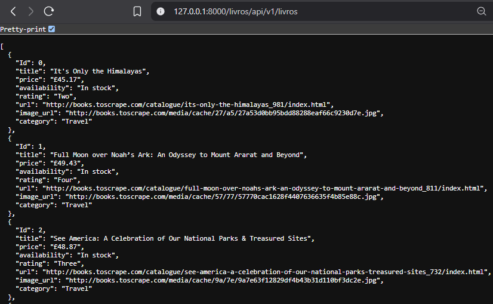
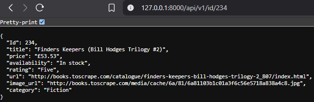
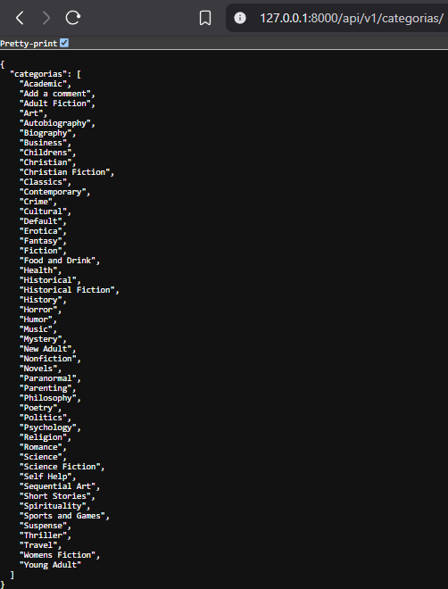
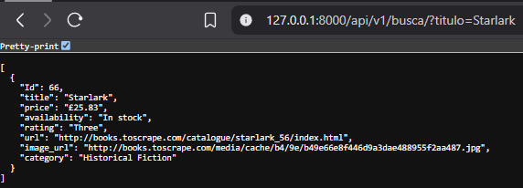
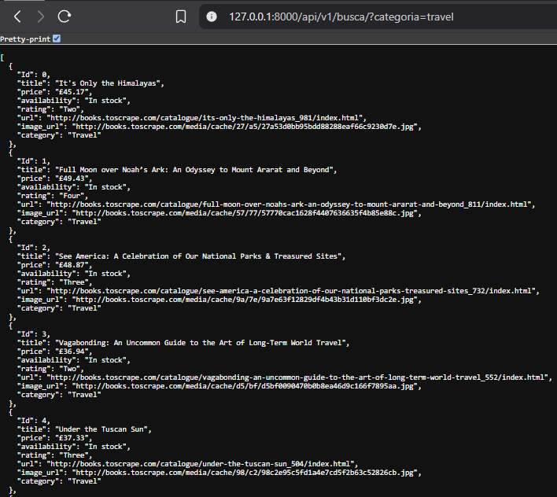

# Exemplos de retorno para cada rota da API

---

## 1️⃣ Listar todos os livros
**Rota:** `/livros/api/v1/livros`  
**Exemplo de saída:**  

---

## 2️⃣ Buscar livro por ID
**Rota:** `/api/v1/id/234`  
**Exemplo de saída:**  

---

## 3️⃣ Listar todas as categorias
**Rota:** `/api/v1/categorias/`  
**Exemplo de saída:**  

---

## 4️⃣ Buscar livro por título e/ou categoria
**Rota:** `/api/v1/busca/?titulo=Starlark`  
**Exemplo de saída (Titulo):**  
  
**Rota:** `/api/v1/busca/?categoria=Travel`  
**Exemplo de saída (Categoria):**  
  
**Rota:** `/api/v1/busca/?titulo=Starlark&categoria=Crime`  
**Exemplo de saída (Titulo e/ou Categoria):**  

---

## 5️⃣ Testar conexão com a API
**Rota:** `/api/v1/conexao/`  
**Exemplo de saída:**  

