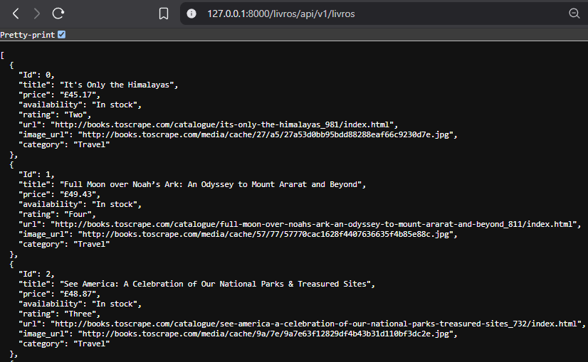
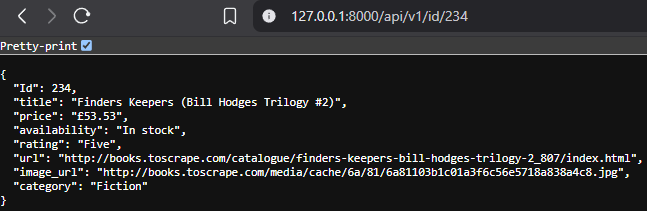
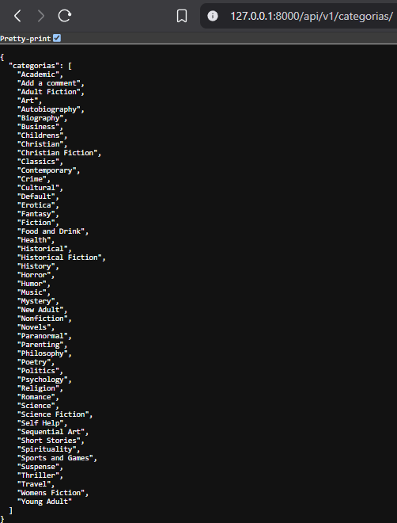
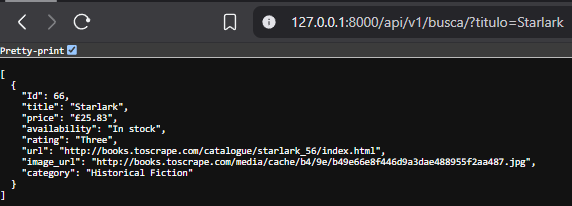
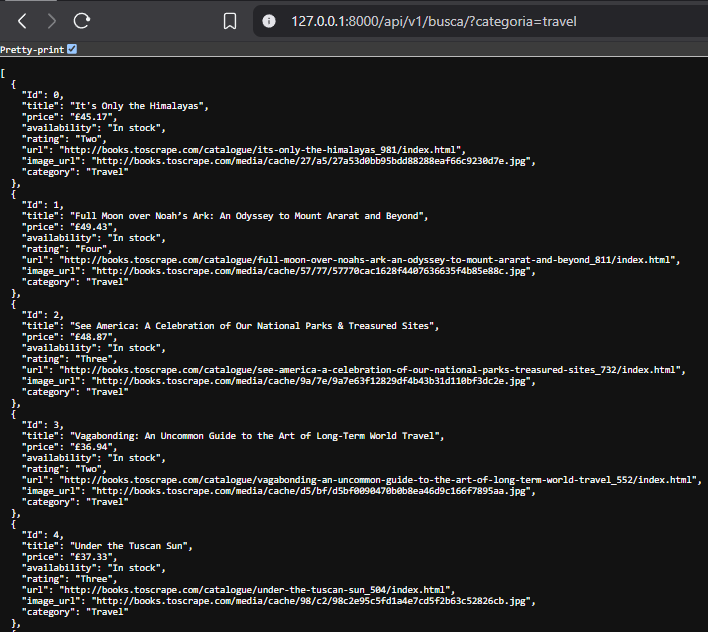
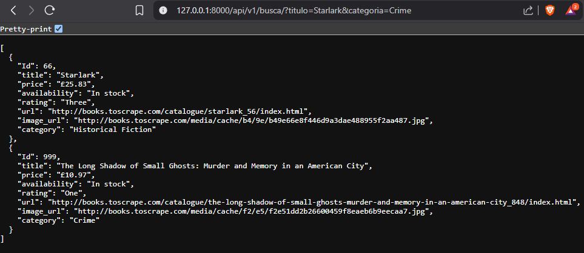
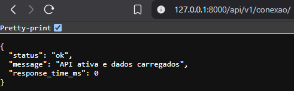

# 📚 TechChallenge - API para Consulta de Livros


---

## 🔎 Sobre o Projeto

Esta API, construída com **FastAPI**, realiza web scraping no site [Books to Scrape](http://books.toscrape.com/) para coletar dados de livros, armazená-los localmente em um arquivo `.csv` e disponibilizá-los via endpoints REST.

O objetivo principal é demonstrar o fluxo completo de integração entre coleta de dados (scraping), manipulação e armazenamento, e disponibilização via API para consumo por cientistas de dados, desenvolvedores e demais interessados.

---

## ⚙️ Funcionalidades

- 📖 Listar todos os livros ou filtrá-los por categoria.
- 🔍 Buscar livros por título e/ou categoria.
- 🏷️ Listar todas as categorias disponíveis.
- 🆔 Consultar um livro pelo seu ID único.
- 🩺 Verificar o status da API e conectividade com o banco de dados.
- 💾 Exportar dados completos para CSV (via geração automática no backend).

## ⚙️ Requisitos

- Python 3.11+
- Git (opcional, para clonar o repositório)
- VSCode

## 🛠 Tecnologias Utilizadas

| Tecnologia      | Descrição                              |
|-----------------|--------------------------------------|
| FastAPI         | Framework web moderno e rápido       |
| Requests        | Requisições HTTP para scraping       |
| BeautifulSoup4  | Extração de dados HTML                |
| Pandas          | Manipulação e exportação de dados    |
| Uvicorn         | Servidor ASGI para execução da API   |
| Pydantic        | Validação de modelos e dados         |


---

## 📥 Instalação

### 1.Instalar o Python

### 2.Instalar o VSCode (ambiente sugerido)

### 3.Instalar o Git (opcional)


## 📦 Instruções de Configuração e Execução

0. **Abre o VS Code**

1. **Obtenção do projeto**    
    **a.Clone o repositório**
    ```bash
    git clone https://github.com/devMansano/TechChallenge.git
    cd TechChallenge
    ```
   **b.Download dos arquivos do Git e abertura da pasta no VSCode**
    

2. **Crie e ative um ambiente virtual**
    python -m venv venv
    # Windows
    venv\Scripts\activate
    # Linux/Mac
    source venv/bin/activate

3. **Instale as dependências**
    pip install -r requirements.txt

4. **Execute o codigo Main.py**
    python Main.py

5. **No acesso Local, utilize: http://127.0.0.1:8000/ ou http://localhost:8000/ para acessar a API**

6. **Utilize os pontos de acesso após o localhost**
    

## 📁 Estrutura do Projeto

```plaintext
TechChallenge/
¦   README.md                   # Documentação do projeto (este arquivo)
¦   Main.py                     # Arquivo principal que inicia a API FastAPI
¦       
+---Config                      # Arquivos de configuração
¦       render.yaml             # Arquivo de configuração do render.com
¦       requirements.txt        # Dependências do projeto
¦                 
+---Dados                       # Dados coletados e processados
¦   ¦   books_complete.csv      # Banco de dados local gerado via scraping
¦   ¦   Extracao.py             # Funções para extrair categorias e livros do site
¦   ¦   gera_base.py            # Criação e leitura do CSV com os dados coletados
¦   
+---Modelo                      # Modelos Pydantic para validação de dados
¦   ¦   Livro.py                # Definição do modelo Book
¦   
¦   
+---Outros                      # Arquivos variados
¦       Diagrama.drawio         # Diagrama em Bloco para ser utilizado no site: https://www.drawio.com/
¦       Diagrama.jpeg           # Diagrama em Imagem
¦       Pos_tech - Tech Challenge - Fase 1 - Machine Learning Engineering.pdf           # Arquivo de apoio do pedido
¦       
+---Rota                        # Endpoints da API organizados em módulos
¦   ¦   bem_vindo.py            # Rota raiz com mensagem de boas-vindas
¦   ¦   conexao.py              # Endpoint para checar saúde da API / status da base
¦   ¦   id.py #                 # Busca de livro pelo ID
¦   ¦   listar_categorias.py    # Rota para listar categorias disponíveis
¦   ¦   listar_livros.py        # Rota para listagem geral de livros
¦   ¦   titulo_categoria.py     # Busca de livros por título e/ou categoria
```

## 📌 Pontos de Acesso
Método	Endpoint	Descrição

- GET	/	--> Mensagem de boas-vindas
- GET	/categorias	--> Lista todas as categorias
- GET	/livros -->	Lista todos os livros (ou filtra por categoria)
- GET	/api/v1/id/{Id} -->	Busca livro por ID
- GET	/api/v1/busca?title=&category -->	Busca por título e/ou categoria
- GET	/api/v1/conexao -->	Verifica status da API

### Exemplos de retorno para cada rota da API

---

#### 1️⃣ Listar todos os livros
**Rota:** `/livros/api/v1/livros`  
**Exemplo de saída:**  


---

#### 2️⃣ Buscar livro por ID
**Rota:** `/api/v1/id/234`  
**Exemplo de saída:**  


---

#### 3️⃣ Listar todas as categorias
**Rota:** `/api/v1/categorias/`  
**Exemplo de saída:**  


---

#### 4️⃣ Buscar livro por título e/ou categoria
**Rota:** `/api/v1/busca/?titulo=Starlark`  
**Exemplo de saída (Titulo):**  
  
**Rota:** `/api/v1/busca/?categoria=Travel`  
**Exemplo de saída (Categoria):**  
  
**Rota:** `/api/v1/busca/?titulo=Starlark&categoria=Crime`  
**Exemplo de saída (Titulo e/ou Categoria):**  


---

#### 5️⃣ Testar conexão com a API
**Rota:** `/api/v1/conexao/`  
**Exemplo de saída:**  



## 📤 Exportar para CSV
- O arquivo .CSV gerado é armazenado dentro da pasta Dados com nome base_livros.csv.


## 📄 Licença
- Este projeto é apenas para fins educacionais.
O site Books to Scrape é destinado a práticas de web scraping e não contém dados reais.